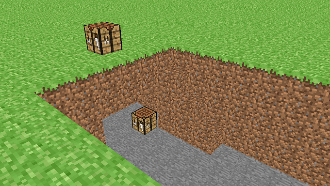
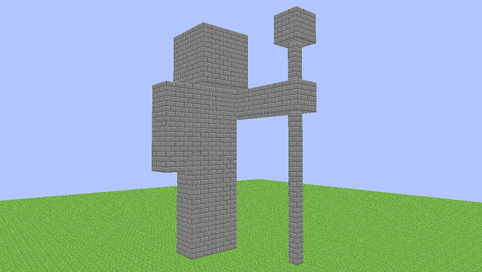

# blockgame-vb
Antigo projeto de 2020 usando DirectX 8 para renderizar uma demo com blocos

WASD -> Mover  
Barra de espaço -> Ir para cima  
Shift -> Ir para baixo

Clique Esquerdo -> Deletar bloco  
Clique Direito -> Criar bloco

### Screenshots

